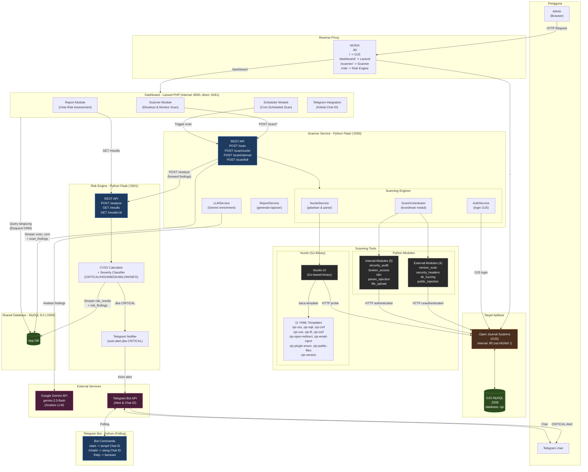

# Arsitektur Sistem Capstone OJS Scanner



---

## Ringkasan Komponen

| Komponen | Teknologi | Port | Peran |
|---|---|---|---|
| NGINX | Nginx | :80 | Reverse proxy, satu pintu masuk semua layanan |
| Dashboard | PHP Laravel | internal :8000 (direct :8181) | UI scan, laporan, jadwal, Telegram |
| Scanner Service | Python Flask | :5000 | Orkestrator scan (Nuclei + Python modules) |
| Risk Engine | Python Flask | :5001 | CVSS scoring, klasifikasi severity, alert |
| Telegram Bot | Python (polling) | - | Tampilkan Chat ID ke pengguna |
| OJS App | PHP (target) | internal :80 (via NGINX) | Target yang dipindai |
| Nuclei | Go binary | - | Vulnerability scanner via YAML templates |
| App DB | MySQL 8.0 | :3309 | Shared DB (scan + risk + user data) |
| OJS DB | MySQL 8.0 | :3308 | Database khusus OJS |
| Google Gemini | External API | - | Analisis & enrichment findings dengan LLM |
| Telegram API | External API | - | Kirim alert CRITICAL & Chat ID |

## URL Akses (via NGINX di port 80)

| Layanan | URL |
|---|---|
| OJS | http://localhost/ |
| Dashboard | http://localhost/dashboard/ |
| Scanner API | http://localhost/scanner/ |
| Risk Engine API | http://localhost/risk/ |

## Alur Scan (Ringkas)

```
User -> Dashboard -> Scanner Service
                        - Nuclei (Go) + 11 YAML templates
                        - 4 External Python Modules
                        - 5 Internal Python Modules (auth)
                        - Gemini LLM (enrichment)
                              |
                              v
                        Risk Engine
                              - Hitung CVSS score
                              - Klasifikasi severity
                              - Simpan ke database
                              - Jika CRITICAL -> Telegram Alert
                              |
                              v
                        Dashboard (laporan & visualisasi)
```
